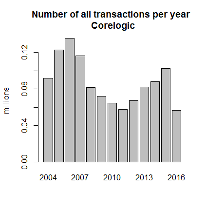

```{r setup, include=FALSE}
knitr::opts_chunk$set(echo = TRUE)
```

```{r echo=FALSE, results='hide', include=FALSE}
library(bit64)
library(dplyr)
library(data.table)
```
class: inverse, center, middle
# Cleaning and Adjustments
---

### Cleaning and Adjustments

<ol start="1">
  <li> Information included in each dataset we use:</li>
</ol>

  Dataset         |    Numb of Obs  | % of Original Data   |   Numb of Vars  |    Notes                                           
------------------|-----------------|----------------------|-----------------|----------------------------------------------------
InfoUSA           |    27,121,086   |                      |63               |  Some zips don't show in every year                
Corelogic         |    1,991,222    |                      |27               |  'transaction_type'==1 'absentee_owner_status' == S

<br>

Variables in InfoUSA:
```{r echo=FALSE, tidy.opts=list(width.cutoff=40)}
options(width = 80)
info_100 <- read.csv("infousa_nc_head100.csv")
core_100 <- read.csv("core_nc_head100.csv")
core_2_100 <- read.csv("core_nc_head100.csv")
colnames(info_100)
```

---

### Cleaning and Adjustments

Variables in Corelogic:
```{r echo=FALSE}
options(width = 80)
colnames(core_100)
```

---

### Cleaning and Adjustments

<ol start="2">  
  <li> All the key variables should be of the same type. Because of 'overflowing' issues, <b>we use 'integer64' instead of 'integer'</b> for 'zip' and 'house_number'. Here some info of the datasets and key variables after the cleaning and adjustments:</li>
</ol>
<br>


Dataset           |    Numb of Obs  |   NAs - InfoUSA |   NAs - Corelogic
------------------|-----------------|-----------------|-----------------
first_name_1      |    "character"  |   0             |     5  
last_name_1       |    "character"  |   0             |     5
zip               |    "integer64"  |   0             |     290
street_name       |    "character"  |   0             |     0
house_number      |    "integer64"  |   23,488        |     0 


 
 
---

### Cleaning and Adjustments

<ol start="3">
  <li> Then we deal with variables that involve dates. We want a numeric format of the form yyyymmdd. <b> There are 351,034 zero values for 'sale_date'. Some meaningful interpretation for those? </b></li>
  <br>
  <li> We create a  variable that only indicates the year --> 'year_date' and keep only observations for 2004 onwards. <b> We remove 851,895 observations with this.</b></li>
  <br>
  <li> We want to exclude corporations in Corelogic. We use the 'corporation_indicator' but we also inspect for string patterns in the name that could allow us to exclude additional corporations that are not being picked up by the indicator. <b> We remove 54,254 observations with this adjustment.</b> </li>
  <br>
  <li> We also exclude all observations in both InfoUSA and Corelogic where 'last_name_1' is empty. <b> We remove 53 observations in InfoUSA and 34 for Corelogic after all the previous adjustments. Before adjustments we would have deleted 54,254 obs for Corelogic. </b> </li>
  <br>
  <li> We then correct inconsistencies in the names and addresses (we remove initials from names and delete 0's in address name). <b> No data is lost with this </b> </li>
</ol>

---

### Cleaning and Adjustments

Here are the number of observations per year in Corelogic:

.middle.center[

]
---
class: inverse, center, middle
# Merging Procedure
---

### Merging Procedure

<ol start="1">
  <li> We first do some consistency checks. Var types should be the same and formats should be consistent.<b> Here we check the class of the key variables for the merge in each dataset.</b></li>
</ol>
<br>
```{r echo=FALSE}

merge_keys <- c("first_name_1", "last_name_1", "zip", "street_name", "house_number")

info_100$zip <- info_100$zip %>% as.integer64()
info_100$house_number <- info_100$house_number %>% as.integer64()

core_2_100$zip <- core_2_100$zip %>% as.integer64()
core_2_100$house_number <- core_2_100$house_number %>% as.integer64()

print("InfoUSA")
sapply(info_100[,merge_keys], class) 


```
<br>

```{r echo=FALSE}
print("Corelogic")
sapply(core_2_100[,merge_keys], class) 
```

---

### Merging Procedure

Here we inspect a very small random sample of both datasets
.pull-left[
```{r echo=FALSE}
options(width = 40)
info_100 <- info_100 %>% as.data.table()
core_2_100 <- core_2_100 %>% as.data.table()

samp <- sample(nrow(info_100),6)

print("InfoUSA")
info_100[samp, c("first_name_1", "last_name_1", "zip", "street_name", "house_number")]

```
]

.pull-right[
```{r echo=FALSE}
options(width = 40)
samp <- sample(nrow(core_2_100),6)

print("Corelogic")
core_2_100[samp, c("first_name_1", "last_name_1", "zip", "street_name", "house_number")]
```
]

---

### Merging Procedure

<ol start="2">
  <li> We treat Corelogic as the 'master' and create a unique identifier of rows to keep track of matches. <b> Question: What combinations of variables in Corelogic makes a unique row identifier? Transaction-person/owner? </b> Looks that way. If we group by 'apn_unformatted', 'first_name_1' and 'last_name_1' and count the observations with that grouping we get something close to the total `nrow(core_nc_2)`.</li>
</ol>

<br>
  
```{r eval=FALSE}
core_nc_2$temp_id_core <- seq(nrow(core_nc_2))

# Looks like transaction-person or something close is what gives us a unique obervation per row
nrow(unique(core_nc_2[,.GRP, by=c("apn_unformatted", "first_name_1", "last_name_1")]))
```

---
### Merging Procedure

Merge iteration                        | Keys used for unmatched                                                |    % of matches
---------------------------------------|------------------------------------------------------------------------|-----------------
merge_1 (no unmatched yet)             |    "first_name_1", "last_name_1", "zip", "street_name", "house_number" | 88.72
merge_1 + merge_2                      |    "first_name_1", "last_name_1", "zip", "street_name                  | 89.17
merge_1 + merge_2 + merge_3            |    "first_name_1", "last_name_1", "zip"                                | 91.46  
merge_1 + merge_2 + merge_3 + merge_4  |    "first_name_1", "last_name_1"                                       | 95.95

---
class: inverse, center, middle
# Duplicates
---

### Duplicates

Here there might be some discrepancies between my approach and Sarah's results. What are we really looking for here? This is what I think:

**Duplicates:** We want to check if there are instances where there are repeated matches that don't make sense. For me this would be the cases where you have the same row in Corelogic (the same property-person pair) -`this is why we need to know what unique rows mean in Corelogic` - matching the same familyid from InfoUSA more than once in the same year (we only have owner information in InfoUSA and `familyid` can only be repeated in different years) - i.e: the only variable that should allow repeated familyid in InfoUSA is year.

We use this code to confirm that
```{r eval=FALSE}
infousa_nc[, delete:=.GRP, by=c("year", "familyid")]
length(unique(infousa_nc$delete))
nrow(infousa_nc)
```
---

### Duplicates

With the following code we check duplicated rows grouping by the unique row indicator in Corelogic and familyid. The idea is that we should only see matches of the exact same row of Corelogic with the exact same familyid in different years. After merging, you should see the same transaction that happened in 2006 matched with the same familyid for all the years in InfoUSA (from 2006 to 2019) but never repeated in the same year.

```{r eval=FALSE}
sum(duplicated(clean_3, by=c("temp_id_core", "familyid")))
sum(duplicated(clean_3, by=c("temp_id_core", "familyid", "year")))
```

```{r echo=FALSE}
print("9,222,824 duplicates")
print("0 duplicates")
```

If there are duplicates of the exact same row within years, then those are just repeated values that we should delete. This didn't happen in NC.

---
class: inverse, center, middle
# Multiple Transactions
---

### Multiple Transactions

What I understood from Sarah's code and after speaking to her, is that we want only the oldest transaction for each person. This is what I did to accomplish that:

```{r eval=FALSE}
clean_3_f <- clean_3[, .SD[which(sale_date == min(sale_date))], by = .(apn_unformatted, familyid)]
```

What the code is doing is to group by the property indicator 'apn_unformatted' and 'familyid' and only keep the observations that correspond to the oldest date (in terms of days) for each pair apn-familyid.

Sarah's approach used first_name_1 and last_name_1 instead of familyid and used an iterative process that I didn't quite understand. Also at the end she wants to 'assign the most recent InfoUSA ID' but I don't understand the reason. I wanted to check that with you since it might be something important and I'm missing the idea.

**One reason might be that she wants to see if 'familyid' is consistent across years? So she checks if the most recent 'familyid' is the same as the one in the first transaction?**

---

### Multiple Transactions

**This is Sarah's code for this section**:

```{r eval=FALSE}
## SARAH'S CODE --> STILL UNCLEAR 
###########################################################################################################################
#### group data by APN + name ####
# Define a function that does what you need and apply it
# First, select only observations for which year = min year
ans <- attemptI[, .SD[which(year_sale == min(year_sale))], by = .(APN_UNFORMATTED, Owner1_name, Owner1_surname)]
ans <- ans[, `:=` (count = length(unique(temp_ID))), by = .(APN_UNFORMATTED, Owner1_name, Owner1_surname)]

#when there are more than one mortgage on the same year, first select the oldest in terms of days
ans2 <- ans[,.SD[which(count > 1)]]
ans2 <- ans2[, `:=` (days = as.numeric(as.Date(sale_date, origin="1900-01-01"))), by = .(APN_UNFORMATTED, Owner1_name, Owner1_surname)]
ans2 <- ans2[, .SD[which(days == min(days))], by = .(APN_UNFORMATTED, Owner1_name, Owner1_surname)]
ans2 <- ans2[, count := NULL]
ans2 <- ans2[, `:=` (count = length(unique(temp_ID))), by = .(APN_UNFORMATTED, Owner1_name, Owner1_surname)]
ans2 <- ans2[, days := NULL]
ans3 <- ans2[, .SD[which(count == 1)]]

```

---

### Multiple Transactions

**This is Sarah's code for this section**:

```{r eval=FALSE}
# re-merge back the cases we solved this way
ans <- ans[, .SD[which(count == 1)]]
l = list(ans,ans3)
ans <- rbindlist(l)

# now select only observations in ans2 that are still ambiguous (multiple transactions on the same day)
ans2 <- ans2[, .SD[which(count > 1)]]
#If there is still ambiguity, just select the first of the multiple mortgage events activated in the same day
#
keycols = c("APN_UNFORMATTED", "Owner1_name", "Owner1_surname")
setkeyv(ans2, keycols)

ans2 <- ans2[,.SD[which(temp_ID == temp_ID[which.min(year_sale)])], by =  .(APN_UNFORMATTED, Owner1_name, Owner1_surname)]
ans2 <- ans2[, `:=` (count = length(unique(temp_ID))), by = .(APN_UNFORMATTED, Owner1_name, Owner1_surname)]
l = list(ans,ans2)
ans <- rbindlist(l)
rm(ans2, ans3)

# now all APN-name pairs are associated with a single mortgage event. What I need now is to assign the most recent InfoUSA ID
ans <- ans[, `:=` (count = length(unique(FAMILYID))), by = .(APN_UNFORMATTED, Owner1_name, Owner1_surname)]
ans <- ans[, `:=` (most_recent_InfoUSA_ID = FAMILYID[which.max(cohort_year)]), by = .(APN_UNFORMATTED, Owner1_name, Owner1_surname)]
#### end ####
```

---
class: inverse, center, middle
# Creating Year of Birth variable
---

### Year of Birth variable

```{r eval=FALSE}

# Lets see the levels of the age code
table(clean_3$head_hh_age_code)

#Lets combine bin J with bin K
clean_3[head_hh_age_code=="J", head_hh_age_code := "K"]

# Create identifier of first bin  
clean_3[, first_bin := head_hh_age_code[which.min(year)], by="familyid"]

# Specific family example:
example <- clean_3[familyid=="900717150858", .SD]

# We create a flag variable that takes the value of 1 when the age_code becomes different from the first_bin
clean_3[, change_bin:= ifelse(head_hh_age_code!=first_bin, 1, 0), by="familyid"]

# We populate variable 'birth_year' 
bin_code <- unique(clean_3$head_hh_age_code) %>% sort()
bin_code <-bin_code[-1]
bin_min_c <- c(25, 30, 35, 40, 45, 50, 55, 60, 65, 70, 75)

lapply(bin_code, function(i){
  clean_3[head_hh_age_code==i, bin_min := ..bin_min_c[which(bin_code==i)],by="familyid"]
})

clean_3[, bin_min := as.numeric(bin_min)]
clean_3[change_bin==1, `:=` (birth_year = year - bin_min), by="familyid"]

#(...)
```

---
### Year of Birth variable

Sarah's approach:

```{r eval=FALSE}
### Compute year of birth ####
ans <- ans[, `:=` (count = length(unique(HEAD_HH_AGE_CODE))), by = .(APN_UNFORMATTED, Owner1_name, Owner1_surname)]
ans2 <- ans[, .SD[which(count > 1)]]
ans2 <- ans2[, `:=` (min_age = HEAD_HH_AGE_CODE[which.min(cohort_year)]), by = .(APN_UNFORMATTED, Owner1_name, Owner1_surname)]
ans2 <- ans2[, `:=` (switch_year = min(cohort_year[which(HEAD_HH_AGE_CODE != min_age)])), by = .(APN_UNFORMATTED, Owner1_name, Owner1_surname)]
# Work on the observations with min_age == J because that's usually an initial, imprecise measurement 
ans2 <- ans2[min_age == 'J', min_age := HEAD_HH_AGE_CODE[min(which(cohort_year == switch_year))], by = .(APN_UNFORMATTED, Owner1_name, Owner1_surname)]
ans2 <- ans2[, `:=` (switch_year = min(cohort_year[which(HEAD_HH_AGE_CODE != min_age)])), by = .(APN_UNFORMATTED, Owner1_name, Owner1_surname)]

# Now define the year of birth
ans2 <- ans2[, `:=` (year_of_birth = 0)]

ans2 <- ans2[min_age == 'A', year_of_birth := switch_year - 25]
ans2 <- ans2[min_age == 'B', year_of_birth := switch_year - 30]
ans2 <- ans2[min_age == 'C', year_of_birth := switch_year - 35]
ans2 <- ans2[min_age == 'D', year_of_birth := switch_year - 40]
ans2 <- ans2[min_age == 'E', year_of_birth := switch_year - 45]
ans2 <- ans2[min_age == 'F', year_of_birth := switch_year - 50]
ans2 <- ans2[min_age == 'G', year_of_birth := switch_year - 55]
ans2 <- ans2[min_age == 'H', year_of_birth := switch_year - 60]
ans2 <- ans2[min_age == 'I', year_of_birth := switch_year - 65]
ans2 <- ans2[min_age == 'K', year_of_birth := switch_year - 70]
ans2 <- ans2[min_age == 'L', year_of_birth := switch_year - 75]

ans2 <- ans2[-which(ans2$min_age == 'J')] #remove the observations who still have min_age == J (only 20 in Delaware)

#work with those who don't change year code
```

---

### To DO

  1. Understand why Sarah wanted to "assign the most recent InfoUSA ID" after keeping oldest transactions.
  
  2. Wrap up and double check the birth year variable creation. Manage cases where there wasn't a bin change --> Average.
  
  2. **Groupings**: I'm realying on 'familyid' and Sarah is using first and last name together with apn. Also, what combinations of vars would be a unique indicator for Corelogic. It seems to be transaction-owner. Should we group by the Corelogic Row index? or similarly to Sarah, by apn and name?
  
  3. Double check section 8. I get different results as Sarah.
  
  4. Think about a strategy to track people moving. What else is relevant regarding this?
  
  
  
