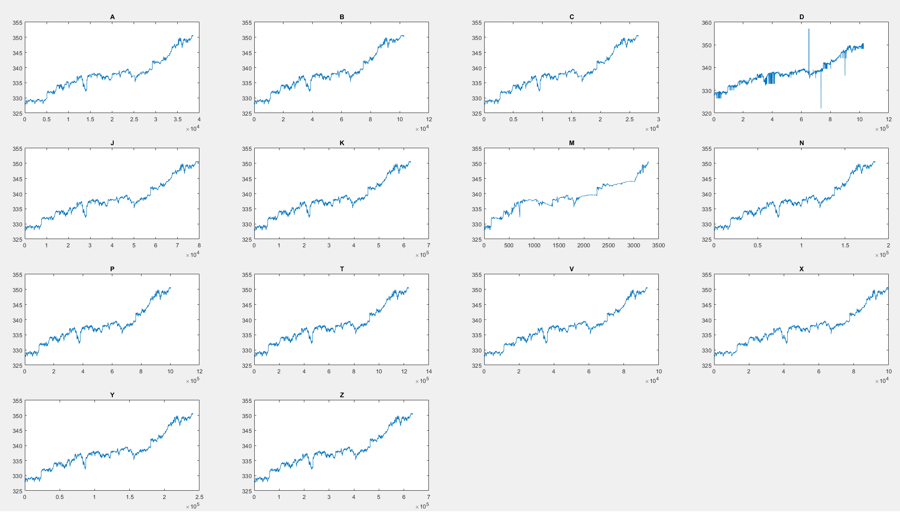
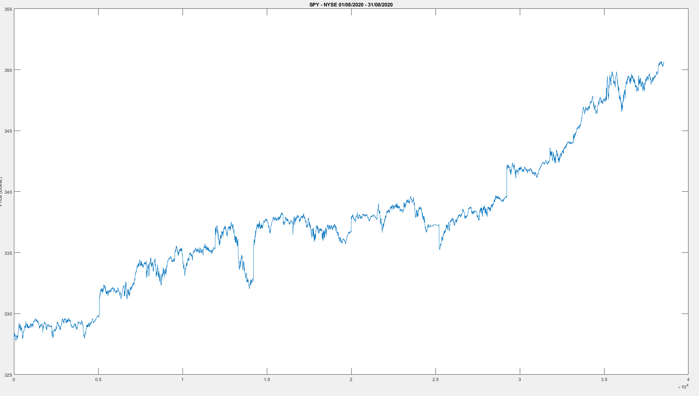

```{r setup, include=FALSE}
knitr::opts_chunk$set(echo = TRUE, message = FALSE, warning = TRUE,
                      comment = "#>")
```

```{r packages, echo=FALSE}

library(knitr)
library(tidyverse)
library(purrr)
library(tidyquant)
library(ggpubr)

library(vroom)
library(kableExtra)

library(dygraphs)
library(xts)          # To make the convertion data-frame / xts format
library(lubridate)
library(htmltools)
library(astsa)
library(TTR)
library(quantmod)

library(kableExtra)
library(magick)
```

### Outline

  1. Assets, periods and relevant economic events (plot daily SP just to show volatility in march)
  
  2. Data handling and cleaning
  
  3. Descriptive stats and distribution
  
  4. Realized Volatility and co-Movements between assets
  
  6. Signature Plot
  
  7. Main takeaways
  
---

### 1) Assets, periods and economic events

.pull-left[
Asset        |    Sector
-------------| -------------
SPY          |    SPDR S&P 500 ETF
XLF          |    Financial
XLK          |    Technology 
GLD          |    Gold 
UUP          |    US Dollar 
]

.pull-right[
Period         |   Relevant Events
---------------|--------------
09/16/2019     |    Repo Mkt. Crisis
03/09/2020     |    SP500 down -7.6%
03/12/2020     |    SP500 down -9.5%  
03/17/2020     |    SP500 down -12% 
8/27/2020      |    J. Powell Speech
]

```{r echo=FALSE, results='hide'}

getSymbols(Symbols = 'SPY', from = "2019-07-01", src = 'yahoo')

spy_ret <- periodReturn(SPY$SPY.Close,
             period='daily',
             subset=NULL,
             type='log',
             leading=TRUE,
             )

```
<br>
```{r echo=FALSE, fig.height=3.8, fig.width=7.8, fig.align='center'}

a <- dygraph(spy_ret, main = "SPY daily returns (SP500_ETF)") %>% 
  dyOptions(strokeWidth = 1, colors = "blue") %>% 
  dyRangeSelector() %>% 
  dyShading(from = "2019-9-5", to = "2019-9-25", color = "lightgray") %>% 
  dyShading(from = "2020-3-1", to = "2020-3-25", color = "lightgray") %>% 
  dyShading(from = "2020-8-19", to = "2020-8-31", color = "lightgray")
a
```

---

### 2) Data Handling and Cleaning

* Brownlees et al. (2006): Use the 'trade_correction_indicator' and 'sale_conditions' to exclude incorrectly reported data.

(...)
---

### SPY - All the Exchanges

.middle.center[



]

---

### SPY - only NYSE

.middle.center[



]

---

### SPY

```{r echo=FALSE, eval=FALSE}

spy_small_2 <- vroom('spy_m_2.csv') %>% as.data.table()

a <- dygraph(spy_small_2$price, main = "SPY levels") %>% 
  dyOptions(strokeWidth = 1, colors = "black") %>% 
  dyRangeSelector() %>% 
  dyShading(from = "2020-3-1", to = "2020-3-25", color = "lightgray") %>% 
  dyShading(from = "2020-8-19", to = "2020-8-31", color = "lightgray")
a

```


