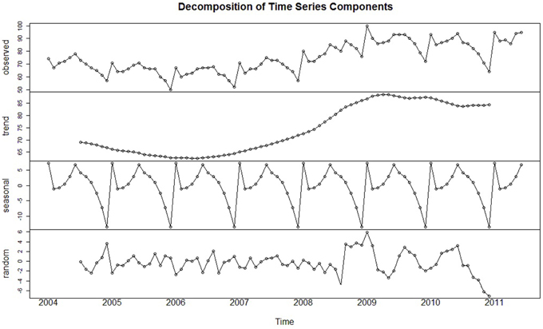

```{r setup, include=FALSE}
knitr::opts_chunk$set(echo = TRUE, message = FALSE, warning = TRUE,
                      comment = "#>")
```


```{r packages, include=FALSE, echo=FALSE}

library(knitr)
library(tidyverse)
library(purrr)
library(tidyquant)
library(ggpubr)


library(dygraphs)
library(xts)          # To make the convertion data-frame / xts format
library(lubridate)
library(htmltools)
library(astsa)
library(TTR)
library(quantmod)
```

class: inverse, center, middle

# ¿En qué nos sirve el análisis de Series de Tiempo?

---
### ¿En qué nos sirve el análisis de Series de Tiempo?

*   Entender el pasado y predecir el futuro.

*  Queremos cuantificar / estimar las principales características en el comportamiento de la data a través del tiempo --> **Componentes determinísticos** y **variación aleatoria** 

* Algunas aplicaciones / ejemplos:

  + **Política Económica**: 
      - Bancos Centrales
      - Ministerios de Economía y agencias de estadísticas.
      - Reguladores 
  
  + **Industria**: 
      - Industria aeroespacial 
      - Bancos - créditos 
      - Traders, bancos de inversión, fondos - pricing y estrategia 


---
class: inverse, center, middle

# Una Primera Mirada

---

### ¿Qué es una Serie de Tiempo?

* Las series de tiempo se forman al **medir una variable secuencialmente a través del tiempo** por un periodo determinado. Muchas variables son series de tiempo intrínsecamente (sobre todo en macro y finanzas).

* Teóricamente, las series de tiempo son **realizaciones particulares de variables aleatorias medidas secuencialmente**. En otras palabras, asumimos que cada punto que observamos en la serie de tiempo proviene de un proceso generador de datos que sigue una distribución de probabilidad particular. 


### Características especiales de las ST

* A diferencia de la econometría de corte transversal, en el modelamiento de series de tiempo el supuesto de **no autocorrelación serial** ya no es válido. De hecho, en series de tiempo, necesitamos esta autocorrelación. Vamos a modelar la autocorrelación explícitamente.

---
### Características especiales de las ST

* Otra característica fundamental del análisis de series de tiempo es la descomposición y modelamiento de **sus componentes determinísticos** como la tendencia, componente estacional y ciclo.  

* Las dinámica de las series de tiempo también es influenciada por un componente estocástico / aleatorio el cual está recogido en la perturbación. Una propiedad deseable es que la influencia del componente aleatorio se vaya disipando en el tiempo pero esto no siempre ocurre. Cuando el componente estocástico es persistente (no decae en el tiempo) se dice que la serie tiene una **tendencia estocástica** o una **raíz unitaria**.

.middle.center[



]

---
class: inverse, center, middle

# Algunos ejemplos

---

#### Gráficos de los conceptos mencionados y el código de R para producirlos

.pull-left[
**Tendencia Determinística**: Creditos de consumo en EEUU - FRED data
```{r fig.height=3, fig.width=4.5, fig.align='center'}

con_cred <- read.csv(file = "TOTALSL.csv",header = TRUE)

# Since DATE is a factor, I have to convert it to a date-time format (POSIXct). We are using 'lubridate' package here.
con_cred$DATE <- parse_date_time(con_cred$DATE, "%Y-%m-%d")
 
# Then you can create the xts necessary to use dygraph. xts (Extensible Time Series) is a more flexible object than data frames to hold TS data.
con_cred_xt <- xts(x = con_cred$TOTALSL, order.by = con_cred$DATE)

# Nice graph
a <- dygraph(con_cred_xt) %>% 
  dyOptions(strokeWidth = 2, colors = "red") %>% 
  dyRangeSelector()
a

```
]

.pull-right[
**Variaciones Estacionales**: Índice de Producción en Manufactura en EEUU (sin ajuste estacional) - FRED data
```{r fig.height=2.5, fig.width=4.5, fig.align='center'}

manuf_prod <- read.csv(file = "IPGMFN.csv",header = TRUE)

manuf_prod$DATE <- parse_date_time(manuf_prod$DATE, "%Y-%m-%d")
 
manuf_prod_xt <- xts(x = manuf_prod$IPGMFN, order.by = manuf_prod$DATE)

b <- dygraph(manuf_prod_xt) %>%
  dyOptions(labelsUTC = TRUE, fillGraph=TRUE, fillAlpha=0.5, drawGrid = FALSE, colors="#D8AE5A") %>%
  dyRangeSelector() %>%
  dyCrosshair(direction = "vertical") %>%
  dyHighlight(highlightCircleSize = 5, highlightSeriesBackgroundAlpha = 0.2, hideOnMouseOut = FALSE) 
b

```
]

---
**Componente Cíclico**: Ratio de Créditos sobre PBI (Credit-to-GDP ratio) de 4 países -BIS data

Acá mostramos la manipulación que necesitamos hacer a la data del BIS antes de producir el gráfico.

```{r}

gaps <- read.csv(file = "cred_gdp_gap.csv",header = TRUE)

# There are some columns we don't need
gaps <- gaps %>% select(-c(1,3,4,5,6))
colnames(gaps)[1] <- "COUNTRY"

# We need to change the structure from 'wide' to 'long' using function 'gather()'
gaps_long <- gather(data = gaps, key = "DATE", value = "GAP", -COUNTRY)

# First lets get rid of the "X" in the DATE variable and change the "." for "-" using 'regular expressions'
gaps_long$DATE <- gaps_long$DATE %>% str_remove("X") %>% str_replace_all("\\.", "-")

# Now lets keep only the abbreviations in the countries' names
gaps_long$COUNTRY <- gaps_long$COUNTRY %>% str_remove_all(":.*")

# Lets change DATE format as we did before using lubridate's 'parse_date_time()' function
gaps_long$DATE <- parse_date_time(gaps_long$DATE, "%d-%m-%Y")

```

---
**Componente Cíclico**: Ratio de Créditos sobre PBI (Credit-to-GDP ratio) de 4 países -BIS data

Más ajustes

```{r}

# Now we need to spread the data into columns for each country using function 'spread()'
gaps_long_clean <- spread(data = gaps_long, key = "COUNTRY", value = "GAP")

# Lets get rid of all the Missing Values
gaps_long_clean <- gaps_long_clean %>% drop_na()
head(gaps_long_clean)

# Finaly lets put it in xt format
gaps_long_xt <- xts(x = gaps_long_clean, order.by = gaps_long_clean$DATE)

# With xt format, we don't need the column DATE anymor
gaps_long_xt$DATE <- NULL 

```


---
**Componente Cíclico**: Ratio de Créditos sobre PBI (Credit-to-GDP ratio) de 4 países -BIS data

Y finalmente..... el gráfico!
```{r fig.height=5.3, fig.width=6.5, fig.align= 'center'} 

  c <- dygraph(gaps_long_xt) %>% 
    dyAxis("y", label = "cred-to-gdp gaps (%)", valueRange = c(-33, 30)) %>%
    dyOptions(axisLineWidth = 1.5, fillGraph = TRUE, fillAlpha=0.2, drawGrid = FALSE, colors = c("yellow", "blue", "green", "black")) %>% 
    dyRangeSelector()
  c
  

```

---
class: inverse, center, middle

# Autocorrelación y el Concepto de Estacionariedad

---

class: inverse, center, middle

# Correlación, Autocovarianza y Autocorrelación
---

### Correlación

* La correlación es una medida 'adimensional' de la asociación lineal entre dos variables $(x, y)$ y se calcula dividiendo la covarianza entre el producto de las desviaciones estándar de las variables. Con eso procedimiento, estandarizamos esta medida para que solo tome valores entre -1 y +1. 

* La correlación poblacional $\rho$ entre $x$ y $y$ se define como:

$$\rho(x,y) = \frac{E[(x-\mu_x)(y-\mu_y)]}{\sigma_x\sigma_y} = \frac{\gamma(x,y)}{\sigma_x\sigma_y}$$

* La correlación muestral se calcula como:

$$\hat{\rho}(x,y) = \frac{\hat{\gamma}(x,y)}{\hat{\sigma}_x\hat{\sigma}_y}$$
* **Autocorrelación**: Mientras que la correlación simple mide la relación lineal entre dos variables distintas, la autocorrelación mide esta misma relación pero entre una serie de tiempo y sus rezagos (sus valores pasados). Es decir, el concepto de autocorrelación involucra solo una variable con dimensión temporal.

---

### Autocorrelación


* Informalmente, decimos que una variable aleatoria muestra **autocorrelación serial** cuando las realizaciones de esa variable dependen en parte de las realizaciones de esa variable en los periodos previos. 

* En el análisis de series de tiempo, la autocorrelación es una **característica recurrente** que además requerimos como parte de la estrategia de estimación y predicción. 

* Como se menciona en cursos básicos de econometría, las variables que muestran una dinámica temporal usualmente están correlacionadas con sus rezagos. **Si está correlación no es abordada (modelada explícitamente o corregida), los residuos cargaran con la autocorrelación y la estimación de los parámetros enfrenta problemas.** 

* Los modelos univariados más usados en Series de Tiempo son los **modelos ARMA** cuya especificación permite **modelar la autocorrelación explícitamente** incluyendo rezagos de la variable de interés. 

---

### Autocovarianza y autocorrelación

<br>

**La función de autocovarianza:**

$$\gamma_k = E[(x_t - \mu_x)(x_{t-k} - \mu_x)]$$
Notar que esta función depende de $k$ y no de $t$. Estamos asumiendo, además, una media constante $\mu$ en cada punto del tiempo.

**La función de autocorrelación de rezago $k$**:

$$\rho_k = \frac{\gamma_k}{\sigma^2_x}$$
Donde $\sigma^2_x$ es la varianza (constante) de $x_t$. Considerando que $\gamma_0$ es equivalente a la varianza de $x_t$, llegamos a que $\rho_0 = 1$.
---

### Las Funciones de Autocorrelación

* La estructura de autocorrelación de una serie de tiempo está definida por la función de correlación.

* La real estructura de correlación del proceso generador de datos no es observable pero la estimamos usando las **Autocorrelation Function (ACF)** y **Partial Autocorrelation Function (PACF)** de la serie de tiempo que estamos analizando.

--
<br>

<ol>
<li> <b>Autocorrelation Function (ACF):</b> </li> 

Primero necesitamos estimar la **función de autocovarianza**. Calculamos su versión muestral a partir de la data.

$$c_k = \frac{1}{T}\sum_{t=1}^{T-k}(x_t-\bar{x})(x_{t+k}-\bar{x})$$

Luego calculamos la **ACF** muestral:

$$r_k = \frac{c_k}{c_0}$$
donde $c_0$ es la varianza muestral
---

### Las Funciones de Autocorrelación
<ol start="2">
<li> <b>Partial Autocorrelation Function (PACF):</li></b>

La autocorrelación parcial al rezago $k$ es la **correlación que resulta luego de remover el efecto de las correlaciones de los elementos con menores rezagos en el modelo**. En general, la autocorrelación parcial al rezago $k$ es el $k$-ésimo coeficiente de un modelo $AR(k)$Ñ

$$y_t = \beta_0 + \beta_1y_{t-1} + ... + \beta_ky_{t-k} + \epsilon_t$$. 


Tanto la **ACF** como la **PACF** serán clave para reconocer el tipo de procesos que se ajustan mejor a la data y elegir el modelo ARMA más apropiado.

---

class: inverse, center, middle

# Estacionariedad
---

### Estacionariedad

* Intuitivamente, la **estacionariedad** implica que las propiedades estadísticas del proceso que genera una serie no cambien en el tiempo. Esto no quiere decir que la serie no cambie en el tiempo. Lo que no cambia en el tiempo es "la forma en la que cambia".

* **Importancia de la estacionariedad**: Facilita el análisis pero, sobre todo, estas regularidades en la forma en la que la serie cambia permite hacer predicciones. 

---

### Estacionariedad

**La estacionariedad débil** requiere que el **proceso estocástico** que teóricamente genera la data, cumpla con lo siguiente: 

  1. **Media Constante**: Debe tener el mismo valor $\mu$ en todos los puntos del tiempo.
  
  2. **Varianza Constante**: Debe tener la misma varianza $\gamma_0$ en todos los puntos del tiempo.
  
  3. La **covarianza** entre los valores de la serie en cualquir par de puntos en el tiempo $(t, t-k)$ **depende solo de la distancia de los rezagos** $k$ (la diferencia entre los dos puntos del tiempo) y no de la ubicación específica de los puntos en el tiempo.

---

### Estacionariedad - Ejemplo

Este es un proceso etacionario conocido como **Ruido Blanco** (media zero y varianza constante).
```{r echo=FALSE, results='hide', fig.height=5, fig.width=8, fig.align='center'}

set.seed(1)
y <- ts(rnorm(200))

forecast::autoplot(y) + 
  theme_bw()+
  theme(panel.grid.major = element_blank(), panel.grid.minor = element_blank(), axis.line = element_line(colour = "black"))+
  geom_hline(yintercept=0, 
                color = "black", size=0.3, linetype=8)

```

---

### Estacionariedad - Ejemplo

Propiedades del **Ruido Blanco**:


<br>

1. **Media Zero**: 

$$E(z_t) = 0  \kern 10mm \forall t$$

2. **Varianza Finita y Constante**: 

$$Var(z_t) = \sigma^2_z < \infty$$

3. **Independiente e identicamente distribuído - No hay autocorrelación serial (i.i.d)**: 

$$Cov(z_t, z_{t-k}) = 0 \kern 10mm \forall t, \kern 3mm \forall k$$

---

### Procesos No Estacionarios - Ejemplo

El Paseo Aleatorio (Random Walk)

```{r echo=FALSE, results='hide'}

ar1 <- function(n, phi0, phi1, mu, sig) {
  e <- rnorm(n, mu, sig)
  x <- matrix(data = NA, nrow = n, ncol = 1)
  x[1,] <- 1
  
  for(t in 2:n){
  x[t,] <- phi0 + phi1*x[t-1,] + e[t]
  }
  x
}

rw <- ar1(200, 0, 1, 0, 1)
rw <- rw %>% as.ts()

```

```{r echo=FALSE, fig.height=6.5, fig.width=8.5, fig.align='center'}

plot(rw, ylab="series")
abline(h=0, col="black", lty=2)

```

---

### Procesos No Estacionarios - Ejemplo


El paseo aleatorio (puro) se modela así:

<br>

$$y_t = y_{t-1} + \epsilon_t$$
<br>

Donde $\epsilon_t$ es ruido blanco con media zero y varianza 1.

**Intución:** Una serie de tiempo no estacionaria no tiene un patrón predecible en su dinámica (por ejemplo, no fluctúa alrededor de una media constante).